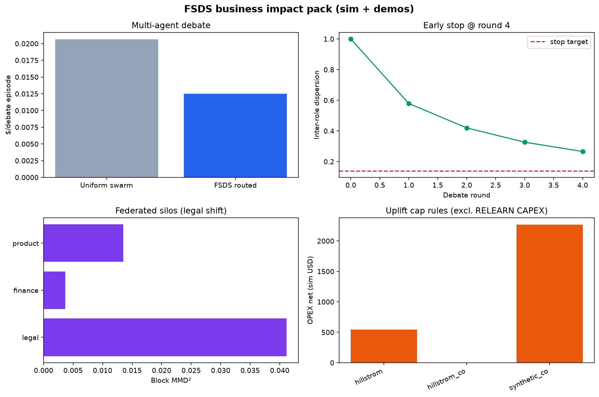

# FSDS — executive summary: effects & economics

*Generated 2026-10-03T05:07:33.300537+00:00 from demo artifacts.*

## What we built (effect)

One statistical spine (**REF/LIVE + receipts**) across:

| Surface | Effect |
|---------|--------|
| **Agent / SoT** | Topology + critical-path budget; covariate monitor explains spend |
| **Multi-agent** | Role-level shift → token/tier/check reallocation; debate early-stop |
| **LangGraph** | Checkpoint embedding = segment; retry drifted nodes only |
| **Uplift** | AUUC + overlap + PO-risk → cap before relearn; OPEX vs CAPEX split |
| **Federated** | Block-level drift; legal silo without centralizing raw features |

## Direct economic benefits (quantified in repo)

| Lever | Demo magnitude | Unit $ | Evidence |
|-------|----------------|--------|----------|
| Agent SoT critical-path budget | ~34% $/episode vs uniform SoT | 0.012 | `artifacts/boss_delivery_six_points.json` |
| Multi-agent FSDS routing (3-role debate) | ~39.3% $/debate vs uniform swarm | 0.0081 | `artifacts/multi_agent_fsds_economics.json` |
| Debate early-stop (dispersion gate) | ~20% fewer debate rounds (macro) | 0.0088 | `artifacts/multi_agent_debate_early_stop.json` |
| Uplift REALLOCATE caps (sim, per monitor window) | OPEX net $3271 across 4 scenario(s) in bench | — | `artifacts/uplift_two_layer_benchmark.json` |
| LangGraph node budget (tool_call drift) | Same Object-2 as SoT on checkpoint embeddings | 0.015349999999999999 | `artifacts/langgraph_fsds_hook.json` |

### Illustrative annualization (compute only)

| Scale | SoT save/yr | Debate FSDS save/yr | Early-stop save/yr |
|-------|-------------|---------------------|---------------------|
| pilot | $7,200 | $974 | $1,061 |
| mid_market | $72,000 | $7,793 | $8,486 |
| platform | $720,000 | $58,447 | $63,648 |

## Potential / strategic benefits (partially simulated)

- **Federated legal block monitor:** Targeted OFS vs global copilot shutdown
- **Federated uplink vs centralized matrix (egress):** Illustrative egress save ~$0.51/yr (config tenants/windows)
- **Audit impact receipts:** Finance-defensible cap/realloc (statistic + rule_id)
- **RELEARN gating (PO-risk + AUUC_ovlp):** Defer CAPEX until OPEX adapt fails
- **Human QA sampling on shifted segments only:** Supervisor FTE on FSDS-localized handoffs

## Dashboard



## Reproduce

```bash
cd Python
python3 run_fsds_business_impact_pack.py
python3 synthesize_fsds_economics_report.py
```
