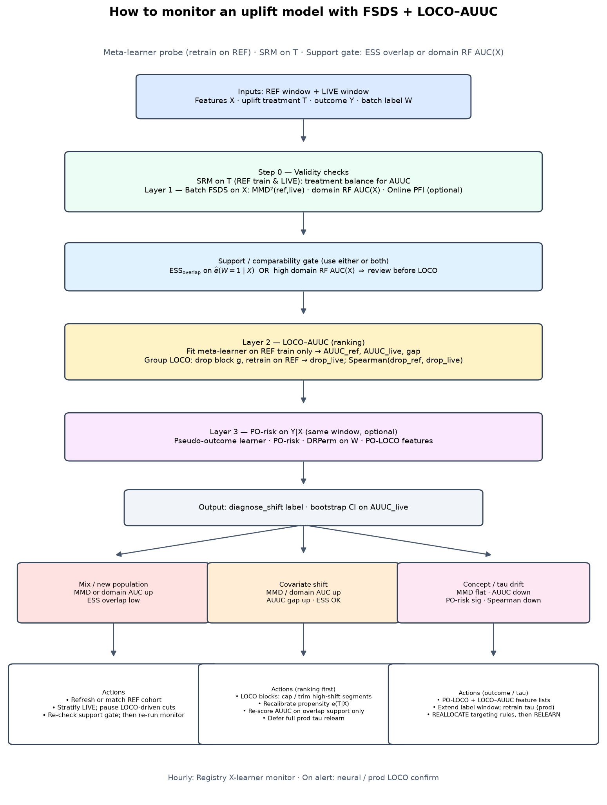

# Uplift model monitoring: LOCO × AUUC under batch shift

## Core idea: meta-learner as the **monitor probe**, not necessarily the prod scorer

Production may serve **DragonNet / TARNet / vendor τ̂**. FSDS monitoring still needs a model that (i) **retrains cheaply on REF** after every LOCO drop and (ii) exposes **AUUC** on REF eval + LIVE. That probe is a **meta-learner** (T-/X-/R-learner or **Model Registry** components: `model_mu`, `model_tau`, `model_e`).

**You do not monitor by “evaluating the frozen prod checkpoint once.”** You monitor by **repeated refit-on-REF** inside the same window protocol; the meta-learner is the object being refit.

| Role | Model | Treatment / label | Output |
|------|--------|-------------------|--------|
| **Prod (optional)** | Neural / any | Train on REF (or full history) | Live **scores** for targeting |
| **Monitor probe** | Registry **X-learner** (typical) | **T** = uplift arm; fit only on **REF train** | **AUUC**, LOCO drops, diagnosis |
| **Concept probe** | Registry **PO-risk** | **W** = REF vs LIVE batch; **Y** = outcome | DRPerm p-value, PO-LOCO on **X** |

Pass `learner_factory` into `run_uplift_monitor` — e.g. `lambda: make_registry_learner("xlearner", model_mu="ridge_regressor", model_tau="ridge_regressor", model_e="logistic_classifier")`. Every LOCO step calls the same factory (see `loco.py`).

**Recommended ops pattern**

1. Fix a **REF** window (calibration batch) and rolling **LIVE**.
2. **Hourly/daily**: meta-learner → `run_uplift_monitor` → MMD(X), AUUC\_ref/live, LOCO, label.
3. **Same window**: `prediction_deltas_on_window` + optional `DRPerm` for **Y\|X** (PO-risk uses the **same registry**, batch indicator **W**, not uplift **T**).
4. **Alert ladder**: MMD↑ → X drift; AUUC\_live↓ + stable MMD → ranking; DRPerm reject + flat MMD → concept; LOCO Spearman↓ → feature reallocation.
5. **Prod coupling**: if prod is neural, run monitor meta-learner in parallel; **disagreement** (meta AUUC OK, prod AUUC bad, or LOCO top features differ) triggers deep LOCO on prod or relearn — do not replace cheap monitor with full neural LOCO every hour.

Meta-learner choice: **Registry Logistic/Ridge X** for speed; **RF X** if nonlinear but still tabular. Match registry keys to your DRPerm/PO-risk config so uplift and concept layers are one stack.

## Why not reuse batch FSDS alone?

Batch FSDS (MMD, domain AUC, overlap on **X**) answers: *did the input population change?*

An uplift/CATE model adds a second object: **ranking quality** — does \(\hat\tau(X)\) still put high-increment users first?

| Signal | What breaks | Typical cause |
|--------|-------------|---------------|
| MMD↑ on **X**, AUUC\_ref OK, **AUUC\_live↓**, overlap OK | **Ranking on LIVE** | Covariate shift: new regions/channels; propensity \(e(X)\) drift; support mismatch |
| MMD flat, **AUUC\_ref↓** and **AUUC\_live↓** | **True ranking** | Concept drift: \(P(Y\mid T,X)\) or CATE changed |
| LOCO drop profile **REF vs LIVE** (Spearman ↓) | **Which features drive targeting** | Concept or policy change; need Group LOCO |
| overlap\_ess ↓ | Attribution / LOCO unreliable | Mix shift — stratify ref before LOCO |

**LOCO-AUUC monitoring** = after each leave-one-feature (or group) out: **retrain \(\hat\tau\) on REF only**, then **recompute AUUC** on REF holdout **and** LIVE. No shortcut importance on a frozen model.

## Procedure (production window)

1. **SRM** on REF train and LIVE (treatment balance).
2. Train uplift learner on **REF train** (T-/X-/R-learner or Model Registry DR path).
3. **Baseline AUUC**: REF eval + LIVE (same frozen train set).
4. **LOCO loop** (parallel optional): for each feature or group \(g\):
   - Drop \(g\), retrain on REF train
   - Predict on REF eval + LIVE
   - `drop_ref = AUUC_full_ref − AUUC_loco_ref`
   - `drop_live = AUUC_full_live − AUUC_loco_live`
5. **Diagnostics**: MMD on X (ref vs live), batch overlap ESS, `auuc_gap = AUUC_ref − AUUC_live`, Spearman(`drop_ref`, `drop_live`).
6. **Act**: see diagnosis labels in `loco_auuc.monitor.diagnose_shift`.

## Three layers (feature-specific; no separate multimodal math)

| Layer | Object | Monitor | Attribution |
|-------|--------|---------|-------------|
| **1. \(X\)** | Covariates | MMD²(ref, live), domain AUC on \(X\), overlap ESS on \(\hat e(W{=}1\mid X)\) | Online PFI / permutation VIMP on \(X\) |
| **2. Ranking** | \(\hat\tau(X)\) vs treatment \(T\) | **AUUC** on REF eval + LIVE; `auuc_gap` | **LOCO–AUUC** (retrain on REF after each group drop) |
| **3. \(Y\mid X\)** | Outcome + batch | **PO-risk** + **DRPerm** p-value; \(\Delta\mu\), \(\Delta\tilde Y\) | **PO-LOCO** / PO-LOGO (leave feature or group out, refit PO learner) |

Treatment \(T\) is the uplift arm (email, policy). Batch indicator \(W\in\{0,1\}\) is REF vs LIVE — same FSDS convention as `DRPerm.py` and `online_pfi_registry.py`.

## PO-risk / pseudo-outcome learner: \(Y\mid X\) shift

**What it detects.** MMD only sees \(P(X)\). AUUC only sees whether \(\hat\tau\) still ranks well under \(T\). Neither fully specifies **concept drift**: \(P(Y\mid X)\) or the interaction of outcome residuals with the LIVE batch changed while \(X\) looks stable.

**Construction (Model Registry, cross-fitted).**

1. Stack REF and LIVE: \((X,Y,W)\), \(W=0\) on REF, \(W=1\) on LIVE.
2. Cross-fit \(\hat\mu(X)\approx\mathbb E[Y\mid X]\), \(\hat e(X)\approx\mathbb P(W{=}1\mid X)\).
3. Pseudo-outcome \(\tilde Y = (Y-\hat\mu(X))(W-\hat e(X))\).
4. Fit **pseudo-outcome learner** \(\hat\tau_Y(X)\) (same registry outcome model, e.g. RF/ridge) on \(\tilde Y\).
5. **PO-risk** \(= \frac1n\sum_i \hat\tau_Y(X_i)^2\) — large when batch-associated outcome structure varies with \(X\) beyond what \(\hat e\) explains.

**How to evaluate (same window as AUUC).**

| Metric | Meaning | Code |
|--------|---------|------|
| `po_risk_observed` | Global concept / batch–\(Y\) interaction signal | `prediction_deltas_on_window` |
| DRPerm `p_value` | Permute \(W\), refit → significance of PO-risk | `run_online_registry_stream` / `DRPerm` |
| `delta_mu_mean` | Shift in \(\mathbb E[Y\mid X]\) predictions (live − ref) | registry deltas |
| `delta_pseudo_mean` | Shift in mean pseudo-outcome | registry deltas |
| `delta_tau_mean` | Shift in mean \(\hat\tau_Y(X)\) | registry deltas |
| PO-LOCO VIMP | Feature driving PO-risk (observed − leave-one-out PO-risk) | `merchant_prototype.po_risk_loco` pattern |

**Joint diagnosis with AUUC + MMD.**

- MMD↑, AUUC\_live↓, PO-risk not significant → prioritize propensity / support / covariate ranking fix; LOCO–AUUC on \(X\) blocks.
- MMD flat, AUUC↓, **DRPerm reject** → **\(Y\mid X\)** or effect surface changed; use **PO-LOCO** for outcome-side features, **LOCO–AUUC** for targeting-side features; relearn labels / \(\tau\) model.
- MMD↑ and PO-risk reject → mixed shift; stratify REF, then rerun both attributions.

LaTeX (paste into manuscript): `docs/latex/uplift_fsds_monitoring_po.tex`.

## Link to FSDS-SoT stack

- **L0 batch FSDS** on trace/score features including \(\hat\tau\) summaries → early warning.
- **Group LOCO** = feature groups only (same math as any tabular \(X\)).
- **Registry PO-risk** (`online_pfi_registry`) when \(Y\) is business outcome (conversion, SAR hit).
- **Closed-loop ladder**: REALLOCATE targeting rules before RELEARN CATE model.

## Flowchart & action playbook



When **AUUC_live** drops, use diagnosis + **ESS_ovlp** to choose actions (REALLOCATE before RELEARN): see **`docs/FSDS_UPLIFT_MONITOR_ACTIONS.md`**.

Generate figure: `cd Python && python3 plot_uplift_fsds_monitor_flow.py`.

## Code

```bash
cd Python && python3 demo_loco_auuc_uplift_monitor.py
```

Modules: `Python/loco_auuc/` — `metrics.auuc` (standard cumulative gain), `loco.loco_auuc_monitor`, `monitor.run_uplift_monitor`.

## AML / ops example

- **Treatment**: extra KYC step, model send-to-review, or incentive.
- **Outcome**: SAR flag, loss avoided (lagging).
- **Monitor**: weekly LIVE vs REF; if MMD↑ + AUUC\_gap↑ + overlap OK → recalibrate propensity / stratify; if LOCO profile flips → concept drift → retrain \(\tau\) with new labels, not only refresh rules.
